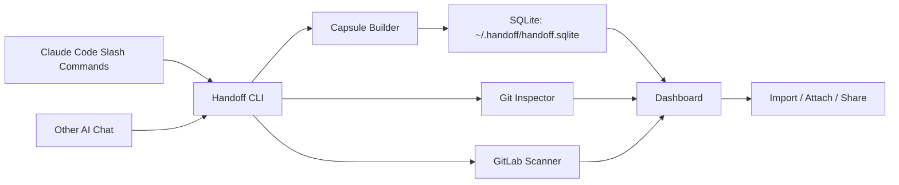

# Handoff Work OS

AI 时代的工作大盘。Handoff 把 Claude Code、其他 AI Chat、Git、GitLab MR 和提醒任务放进同一套本地产品中管理，让一次高价值对话能够被保存、分享、恢复、引用，并和代码交付状态一起展示。


## 产品定位

Handoff 面向频繁使用 AI 编程助手的工程团队。核心对象是 `Capsule`，也就是一次对话形成的可恢复资产。一个 Capsule 保存标题、摘要、进度、下一步、已确认事实、关键决策、相关文件、Git 状态和恢复提示。

Handoff 适合以下场景：

| 场景 | 常见痛点 | Handoff 的处理方式 |
| --- | --- | --- |
| Claude Code 对话进行到一半 | 方案很好，但后续上下文容易丢失 | 通过 `/handoff:capture` 保存为 Capsule |
| 多个 AI Chat 同时讨论同一需求 | A Chat 和 B Chat 的上下文隔离，互相难以继承 | 使用 `attach` 引用另一个 Capsule 的压缩上下文 |
| 方案需要交给同事继续处理 | 转述成本高，事实、决策和下一步容易遗漏 | 使用 `share` 生成分享资料，使用 `import` 恢复完整会话 |
| 一个项目有多个需求并行推进 | 对话、代码提交、MR、CI 和提醒分散 | 大盘统一展示 Capsule、Git 状态、本人 MR 和关注队列 |
| 同一会话多次保存 | 老资料和新资料混在一起 | 同一 `sessionId` 或 `source + chatName` 使用最新 Capsule 替换旧 Capsule |

## 产品思路

Handoff 在 Claude Code Agent 周围补齐团队级能力。Claude Code 负责理解代码、执行命令、修改文件；Handoff 负责把关键对话变成可复用资料，并把资料和工程状态绑定。

核心思路如下：

| 模块 | 作用 |
| --- | --- |
| Capture | 把当前 AI 对话保存为 Capsule |
| Import | 输出完整恢复提示，用于接续完整会话 |
| Attach | 输出压缩上下文，用于把一个 Chat 的背景交给另一个 Chat |
| Share | 生成可分享资料，支持跨成员协作 |
| Dashboard | 展示所有项目的 Capsule、进度、Git 状态、GitLab MR 和提醒 |
| Git Status | 判断当前需求涉及文件是否已经提交，是否已经推送到远端 |
| GitLab Scan | 自动识别本地 `origin` 的 GitLab 项目，只展示当前 Token 用户创建的 MR |
| Reminder | 根据 Capsule、Git 和 GitLab 状态计算需要关注的事项 |

## 当前能力

| 能力 | 状态 |
| --- | --- |
| Claude Code Slash Commands | 已提供 |
| 本地 CLI | 已提供 |
| 本地 Web 大盘 | 已提供 |
| SQLite 统一存储 | 已提供 |
| 多项目切换 | 已提供 |
| Capsule 标题生成 | 已提供 |
| 同会话重复 Capture 替换旧记录 | 已提供 |
| Import 与 Attach 弹窗 | 已提供 |
| Capsule 删除 | 已提供 |
| Git 需求状态识别 | 已提供 |
| GitLab Token 设置 | 已提供 |
| GitLab 本人 MR 扫描 | 已提供 |
| AI 关注队列 | 已提供 |

## 系统要求

| 依赖 | 要求 |
| --- | --- |
| Node.js | `>= 22.5.0` |
| Claude Code | 用于安装插件和使用 Slash Commands |
| Git | 用于识别分支、提交、远端推送状态 |
| GitLab Token | 可选，用于扫描本人 MR |

## 安装

### 从 GitHub 获取源码

```bash
git clone git@github.com:xingdong23/handoff.git
cd handoff
npm run check
```

### 安装本地 CLI

```bash
npm link
handoff --version
handoff --help
```

`npm link` 会把 `handoff` 命令注册到本机 Node.js 全局命令中。开发期间也可以使用源码入口：

```bash
node ./bin/handoff.js --help
```

### 安装 Claude Code 插件

从源码目录安装：

```bash
claude plugin marketplace add "$(pwd)" --scope user
claude plugin install handoff@handoff-marketplace
claude plugin enable handoff
```

核心 Skill 包也可以单独安装：

```bash
claude plugin install handoff-core@handoff-marketplace
claude plugin enable handoff-core
```

从 GitHub 安装：

```bash
claude plugin marketplace add https://github.com/xingdong23/handoff --scope user
claude plugin install handoff@handoff-marketplace
claude plugin enable handoff
```

安装完成后，Claude Code 中会出现以下命令：

| Slash Command | CLI 命令 | 用途 |
| --- | --- | --- |
| `/handoff:capture` | `handoff capture` | 保存当前对话为 Capsule |
| `/handoff:import` | `handoff import` | 输出完整恢复提示 |
| `/handoff:attach` | `handoff attach` | 输出压缩上下文 |
| `/handoff:share` | `handoff share` | 生成分享资料 |
| `/handoff:delete` | `handoff delete` | 删除 Capsule |
| `/handoff:open` | `handoff open` | 打开大盘 |
| `/handoff:status` | `handoff status` | 查看大盘摘要 |
| `/handoff:gitlab-scan` | `handoff gitlab scan` | 扫描 GitLab MR |
| `/handoff:reminders` | `handoff reminders scan` | 重新计算关注队列 |

## 快速开始

### 打开大盘

```bash
handoff open --workspace .
```

默认地址为：

```text
http://127.0.0.1:7349
```

也可以启动服务但保留浏览器关闭状态：

```bash
handoff open --workspace . --no-browser
```

### 保存一次对话

```bash
handoff capture "支付回调超时排查" \
  --source claude-code \
  --chat "cc-main" \
  --session "ticket-525" \
  --stdin <<'JSON'
{
  "summary": "支付回调超时问题已经完成根因分析，当前正在修改连接池配置。",
  "status": "in_progress",
  "progressPercent": 60,
  "currentStep": "已定位连接池耗尽。",
  "nextStep": "补充测试并提交 MR。",
  "facts": ["问题发生在高并发回调场景。"],
  "decisions": ["优先调整连接池配置，随后补充压测。"],
  "files": ["src/payment/callback.ts"],
  "commands": ["npm test"],
  "nextActions": ["补充连接池测试。"]
}
JSON
```

返回内容包含 Capsule id 和存储引用。

### 恢复完整会话

```bash
handoff import <capsule-id>
```

`import` 输出完整 Recovery Prompt，适合把任务交给另一个 AI Chat 接续处理。内容包含当前状态、进度、下一步、Git 需求状态、事实、决策和相关文件。

### 引用另一个会话

```bash
handoff attach <capsule-id>
```

`attach` 输出压缩上下文，适合让当前 Chat 快速了解另一个 Chat 的背景，同时保留当前对话的主要上下文空间。

### 分享 Capsule

```bash
handoff share <capsule-id>
```

返回示例：

```text
token=abc123
url=http://localhost:7349/s/abc123
api=http://localhost:7349/api/share/abc123
```

### 删除 Capsule

```bash
handoff delete <capsule-id>
```

也可以使用标题删除：

```bash
handoff delete "支付回调超时排查"
```

## 大盘

大盘标题为「AI 时代的工作大盘」，用于查看所有项目的整体状态。

大盘包含：

| 区域 | 内容 |
| --- | --- |
| 顶部指标 | 项目数、进行中 Capsule、未合并 MR、CI 异常、提醒数量 |
| 搜索与项目切换 | 搜索项目、Capsule、MR，按项目查看 |
| 主内容 | 只展示会话资产 Capsule |
| 左侧折叠面板 | 展示 GitLab 本人 MR 和 AI 关注队列 |
| 设置弹窗 | 配置全局 GitLab Token，查看自动识别的本地项目 |
| Import 弹窗 | 复制完整恢复提示 |
| Attach 弹窗 | 复制压缩上下文 |

## 数据存储

Handoff 使用本机 SQLite 作为统一数据源，默认文件位置为：

```text
~/.handoff/handoff.sqlite
```

多项目共享同一个数据库。每个项目按 Git 根目录或当前目录注册到 `projects` 表中，Dashboard 从同一份数据库读取所有项目。

可以通过环境变量覆盖数据库文件：

```bash
HANDOFF_DB=/absolute/path/handoff.sqlite handoff status
```

主要表结构：

| 表 | 内容 |
| --- | --- |
| `projects` | 项目信息、根目录、GitLab 项目配置 |
| `capsules` | Capsule 正文、摘要、恢复提示、相关文件、进度 |
| `shares` | 分享 Token 和分享资料 |
| `gitlab_states` | GitLab MR 扫描结果 |
| `attention_states` | AI 关注队列 |
| `meta` | 全局设置，例如 GitLab Token |

`.handoff/` 目录用于兼容旧版本资料导入，并已加入 `.gitignore`。新数据默认进入 SQLite。

## Git 状态

Capsule 会记录当前 Git 快照，并对需求相关文件做专门判断。

Recovery Prompt、Context Pack、Share Pack 和 Attach 输出都会包含：

| 字段 | 含义 |
| --- | --- |
| `Branch` | 当前分支 |
| `Upstream` | 当前分支跟踪的远端分支 |
| `Scope files` | 当前 Capsule 关联的需求文件 |
| `Committed to Git` | 关联文件是否已进入提交 |
| `Pushed to remote` | 关联文件对应提交是否已推送到远端 |
| `Dirty scoped files` | 关联文件中仍有本地修改的文件 |
| `Latest scoped commit` | 关联文件最近一次提交 |
| `Unpushed scoped commits` | 关联文件相关的未推送提交 |

判断范围以 Capsule 的 `files` 字段为准。这样可以避免把项目中无关文件的 Git 状态混入当前需求。

## GitLab 集成

Handoff 会从本地 Git `origin` 自动识别 GitLab 地址和项目 ID。例如：

```text
git@gitlab.example.com:team/service.git
```

会被识别为：

```text
baseUrl=https://gitlab.example.com
projectId=team/service
```

Token 只需配置一次，保存在本机 SQLite 的 `meta` 表中。大盘设置弹窗会显示本地识别到的项目，并提供全局 Token 输入框。

CLI 也支持环境变量：

```bash
export GITLAB_TOKEN=<token>
handoff gitlab scan
```

扫描时会调用 GitLab `/user` 接口，并只读取当前 Token 用户创建的打开状态 MR：

```text
scope=created_by_me
```

大盘左侧面板会展示本人 MR 的标题、源分支、目标分支、文件数、增删行、提交数、CI 状态和合并状态。

## Import 与 Attach 的区别

| 命令 | 输出内容 | 适用场景 |
| --- | --- | --- |
| `import` | 完整 Recovery Prompt | 接续完整会话、交给另一个 AI Chat 继续处理 |
| `attach` | 压缩上下文 | 当前 Chat 需要了解另一个 Chat 的背景 |

`import` 更完整，适合恢复任务；`attach` 更轻量，适合引用资料。

## 架构



目录结构：

| 目录 | 作用 |
| --- | --- |
| `bin/` | CLI 入口 |
| `commands/handoff/` | Slash Command 模板 |
| `.claude/commands/handoff/` | 本地 Claude Code 命令 |
| `.claude-plugin/` | Claude Code 插件市场清单 |
| `plugins/agent-plugins/handoff/` | 完整 Handoff Work OS Agent 插件，包含 Agent Prompt、Skill、Commands、CLI 和大盘入口 |
| `plugins/vertical-plugins/handoff-core/` | Handoff 核心能力包，放置可复用 Skill |
| `plugins/handoff/` | 兼容旧入口，指向 `plugins/agent-plugins/handoff/` |
| `managed-agent-cookbooks/handoff-work-os/` | 托管 Agent 模板，包含 orchestrator 与子 Agent 配置 |
| `scripts/` | 仓库检查脚本 |
| `src/cli/` | CLI 参数和命令处理 |
| `src/core/` | Capsule、SQLite、Git、GitLab、提醒等核心逻辑 |
| `src/server/` | Dashboard API 和静态资源服务 |
| `web/` | 大盘前端 |
| `test/` | Node.js 测试 |

## 开发

### 启动大盘

```bash
npm run dev
```

### 执行检查

```bash
npm run check
```

该命令会执行：

```bash
node --check ./bin/handoff.js
node --check ./src/cli/index.js
node --check ./src/server/index.js
node --test
```

### 校验插件清单

```bash
npm run plugin:validate
```

### 执行完整仓库检查

```bash
scripts/check.sh
```

## 开源说明

Handoff 当前采用 MIT License。项目目标是把 AI 对话、上下文恢复、代码提交、MR 状态和提醒任务整合为本地优先的工程协作产品。

后续版本方向：

| 方向 | 内容 |
| --- | --- |
| 更强的会话采集 | 接入更完整的 Claude Code transcript |
| 更强的分享能力 | 支持团队内权限、过期时间和审计信息 |
| 更多代码平台 | 支持 GitHub Pull Request 和其他 Git 托管平台 |
| 更强的提醒 | 支持定时任务、超时提醒和 MR 状态变化提醒 |
| 更强的大盘 | 支持项目维度、需求维度和人员维度视图 |
