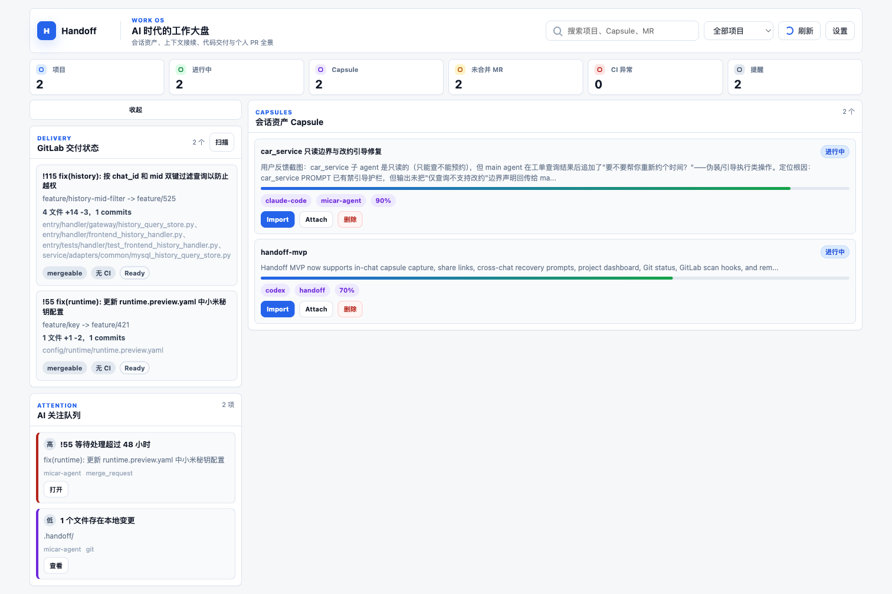
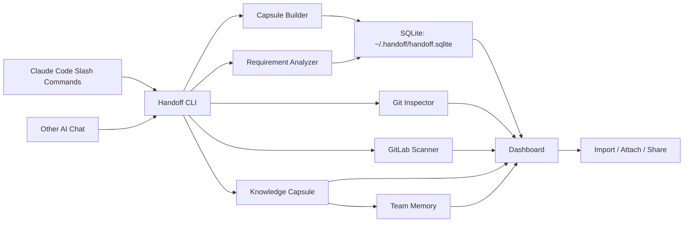

# Handoff Work OS

AI 时代的工作大盘。Handoff 把 Claude Code、其他 AI Chat、Git、GitLab MR 和提醒任务放进同一套本地产品中管理，让一次高价值对话能够被保存、分享、恢复、引用，并和代码交付状态一起展示。



## 产品定位

Handoff 面向频繁使用 AI 编程助手的工程团队。核心对象包括 `Requirement Capsule`、`Capsule`、`Knowledge Capsule`、`Skill Asset` 和 `Team Memory`。需求资料先被分析成结构化 Requirement Capsule，AI 对话再保存为可恢复 Capsule，高质量交流继续抽取为 Knowledge Capsule 或 Skill Asset，审核通过后可分享给团队使用，最后汇总为 Team Memory。

Handoff 适合以下场景：

| 场景 | 常见痛点 | Handoff 的处理方式 |
| --- | --- | --- |
| PRD、需求说明、会议纪要进入研发 | 目标、范围、验收标准和开放问题分散在文本里 | 使用 `requirement analyze` 生成 Requirement Capsule |
| Claude Code 对话进行到一半 | 方案很好，但后续上下文容易丢失 | 通过 `/handoff:capture` 保存为 Capsule |
| 多个 AI Chat 同时讨论同一需求 | A Chat 和 B Chat 的上下文隔离，互相难以继承 | 使用 `attach` 引用另一个 Capsule 的压缩上下文 |
| 方案需要交给同事继续处理 | 转述成本高，事实、决策和下一步容易遗漏 | 使用 `share` 生成分享资料，使用 `import` 恢复完整会话 |
| 团队成员和 AI 解决了一个高价值问题 | 经验散落在单次对话里，后续成员难以复用 | 使用 `knowledge extract` 抽取知识胶囊，再使用 `knowledge share` 分享 |
| 团队需要托管 Skill、知识胶囊和专家经验 | 资料需要专人审核，使用时还要快速进入 AI 对话 | 使用 `skill submit`、`skill review`、`skill share` 和 `skill import` |
| 团队希望持续积累 AI 交流成果 | 单个知识点分散，缺少统一团队记忆 | 定时执行 `memory build` 汇总知识胶囊 |
| 一个项目有多个需求并行推进 | 对话、代码提交、MR、CI 和提醒分散 | 大盘统一展示 Capsule、Git 状态、本人 MR 和关注队列 |
| 同一会话多次保存 | 老资料和新资料混在一起 | 同一 `sessionId` 或 `source + chatName` 使用最新 Capsule 替换旧 Capsule |

## 产品思路

Handoff 在 Claude Code Agent 周围补齐团队级能力。Claude Code 负责理解代码、执行命令、修改文件；Handoff 负责把关键对话变成可复用资料，并把资料和工程状态绑定。

核心思路如下：

| 模块 | 作用 |
| --- | --- |
| Requirement Analyze | 把 PRD、需求说明和会议纪要分析为结构化 Requirement Capsule |
| Capture | 把当前 AI 对话保存为 Capsule |
| Import | 输出完整恢复提示，用于接续完整会话 |
| Attach | 输出压缩上下文，用于把一个 Chat 的背景交给另一个 Chat |
| Share | 生成可分享资料，支持跨成员协作 |
| Knowledge Capsule | 从高质量 AI 对话中抽取可复用团队知识 |
| Skill Platform | 托管 Skill、知识胶囊和专家经验，支持审核、分享和导入当前 AI 对话 |
| Team Memory | 汇总知识胶囊，生成团队知识记忆快照 |
| Dashboard | 展示所有项目的 Capsule、进度、Git 状态、GitLab MR 和提醒 |
| Git Status | 判断当前需求涉及文件是否已经提交，是否已经推送到远端 |
| GitLab Scan | 自动识别本地 `origin` 的 GitLab 项目，只展示当前 Token 用户创建的 MR |
| Reminder | 根据 Capsule、Git 和 GitLab 状态计算需要关注的事项 |

## 当前能力

| 能力 | 状态 |
| --- | --- |
| Claude Code Slash Commands | 已提供 |
| 本地 CLI | 已提供 |
| 本地 Web 大盘 | 已提供 |
| SQLite 统一存储 | 已提供 |
| 多项目切换 | 已提供 |
| Capsule 标题生成 | 已提供 |
| 同会话重复 Capture 替换旧记录 | 已提供 |
| Import 与 Attach 弹窗 | 已提供 |
| Capsule 删除 | 已提供 |
| Git 需求状态识别 | 已提供 |
| GitLab Token 设置 | 已提供 |
| GitLab 本人 MR 扫描 | 已提供 |
| AI 关注队列 | 已提供 |
| 需求文档分析 | 已提供 |
| 知识胶囊抽取 | 已提供 |
| 知识胶囊分享 | 已提供 |
| Skill 托管、审核、分享与导入 | 已提供 |
| 团队知识记忆生成 | 已提供 |

## 系统要求

| 依赖 | 要求 |
| --- | --- |
| Node.js | `>= 22.5.0` |
| Claude Code | 用于安装插件和使用 Slash Commands |
| Git | 用于识别分支、提交、远端推送状态 |
| GitLab Token | 可选，用于扫描本人 MR |

## 安装

### 从 GitHub 获取源码

```bash
git clone git@github.com:xingdong23/handoff.git
cd handoff
npm run check
```

### 安装本地 CLI

```bash
npm link
handoff --version
handoff --help
```

`npm link` 会把 `handoff` 命令注册到本机 Node.js 全局命令中。开发期间也可以使用源码入口：

```bash
node ./bin/handoff.js --help
```

### 安装 Claude Code 插件

从源码目录安装：

```bash
claude plugin marketplace add "$(pwd)" --scope user
claude plugin install handoff@handoff-marketplace
claude plugin enable handoff
```

核心能力包也可以单独安装。它包含 Handoff 的可复用 Skill 与 Slash Command 模板：

```bash
claude plugin install handoff-core@handoff-marketplace
claude plugin enable handoff-core
```

从 GitHub 安装：

```bash
claude plugin marketplace add https://github.com/xingdong23/handoff --scope user
claude plugin install handoff@handoff-marketplace
claude plugin enable handoff
```

安装完成后，Claude Code 中会出现以下命令：

| Slash Command | CLI 命令 | 用途 |
| --- | --- | --- |
| `/handoff:capture` | `handoff capture` | 保存当前对话为 Capsule |
| `/handoff:import` | `handoff import` | 导入资产上下文 |
| `/handoff:asset-list` | `handoff asset list` | 列出统一资产 |
| `/handoff:asset-show` | `handoff asset show` | 查看统一资产 |
| `/handoff:asset-share` | `handoff asset share` | 分享统一资产 |
| `/handoff:asset-import` | `handoff asset import` | 导入统一资产 |
| `/handoff:attach` | `handoff attach` | 输出压缩上下文 |
| `/handoff:share` | `handoff share` | 生成分享资料 |
| `/handoff:requirement-analyze` | `handoff requirement analyze` | 分析需求资料 |
| `/handoff:knowledge-extract` | `handoff knowledge extract` | 从 Capsule 抽取知识胶囊 |
| `/handoff:knowledge-ingest` | `handoff knowledge ingest` | 从文本或文件生成知识胶囊 |
| `/handoff:knowledge-share` | `handoff knowledge share` | 分享知识胶囊 |
| `/handoff:skill-submit` | `handoff skill submit` | 提交 Skill Asset |
| `/handoff:skill-ingest` | `handoff skill ingest` | 从文本或文件生成 Skill Asset |
| `/handoff:skill-from-capsule` | `handoff skill from-capsule` | 从 Capsule 抽取 Skill Asset |
| `/handoff:skill-from-knowledge` | `handoff skill from-knowledge` | 从知识胶囊抽取 Skill Asset |
| `/handoff:skill-review` | `handoff skill review` | 审核 Skill Asset |
| `/handoff:skill-share` | `handoff skill share` | 分享 Skill Asset |
| `/handoff:skill-import` | `handoff skill import` | 导入 Skill Asset 到当前 AI 对话 |
| `/handoff:memory-build` | `handoff memory build` | 汇总知识胶囊为团队知识记忆 |
| `/handoff:delete` | `handoff delete` | 删除 Capsule |
| `/handoff:open` | `handoff open` | 打开大盘 |
| `/handoff:status` | `handoff status` | 查看大盘摘要 |
| `/handoff:gitlab-scan` | `handoff gitlab scan` | 扫描 GitLab MR |
| `/handoff:reminders` | `handoff reminders scan` | 重新计算关注队列 |

## 快速开始

### 打开大盘

```bash
handoff open --workspace .
```

默认地址为：

```text
http://127.0.0.1:7349
```

也可以启动服务但保留浏览器关闭状态：

```bash
handoff open --workspace . --no-browser
```

### 保存一次对话

```bash
handoff capture "支付回调超时排查" \
  --source claude-code \
  --chat "cc-main" \
  --session "ticket-525" \
  --stdin <<'JSON'
{
  "summary": "支付回调超时问题已经完成根因分析，当前正在修改连接池配置。",
  "status": "in_progress",
  "progressPercent": 60,
  "currentStep": "已定位连接池耗尽。",
  "nextStep": "补充测试并提交 MR。",
  "facts": ["问题发生在高并发回调场景。"],
  "decisions": ["优先调整连接池配置，随后补充压测。"],
  "files": ["src/payment/callback.ts"],
  "commands": ["npm test"],
  "nextActions": ["补充连接池测试。"]
}
JSON
```

返回内容包含 Capsule id 和存储引用。

### 分析需求资料

```bash
handoff requirement analyze "支付回调超时治理" --stdin <<'JSON'
{
  "summary": "降低支付回调高峰期超时比例。",
  "background": "高并发回调场景下，连接池等待时间过长。",
  "goals": ["超时比例下降到 0.1% 以下"],
  "scope": ["调整连接池配置", "增加重试上限"],
  "acceptanceCriteria": ["压测通过", "回调成功率达到目标"],
  "openQuestions": ["是否需要灰度开关"],
  "systems": ["payment-service"],
  "files": ["src/payment/callback.ts"],
  "tasks": ["补充压测脚本", "更新配置说明"]
}
JSON
```

返回内容包含 Requirement Capsule id 和存储引用。查看结构化内容：

```bash
handoff requirement show <requirement-id>
```

### 导入统一资产

```bash
handoff import <asset-id-or-token-or-url>
```

`import` 会根据资产类型输出对应上下文。Capsule 输出完整 Recovery Prompt，Knowledge Capsule 输出项目知识上下文，Skill Asset 输出可复用步骤和经验。

统一资产命令也可以完成同样操作：

```bash
handoff asset import <asset-id-or-token-or-url>
```

查看当前项目全部资产：

```bash
handoff asset list
```

### 引用另一个会话

```bash
handoff attach <capsule-id>
```

`attach` 输出压缩上下文，适合让当前 Chat 快速了解另一个 Chat 的背景，同时保留当前对话的主要上下文空间。

### 分享 Capsule

```bash
handoff share <capsule-id>
```

返回示例：

```text
token=abc123
url=http://localhost:7349/s/abc123
api=http://localhost:7349/api/share/abc123
```

### 抽取知识胶囊

从文本或文件生成知识胶囊：

```bash
handoff knowledge ingest "支付回调排障经验" --from ./conversation.md
```

系统会保留来源 Capsule，并返回 Knowledge Capsule id。

从已有 Capsule 抽取知识胶囊：

```bash
handoff knowledge extract <capsule-id>
```

知识胶囊保存摘要、主题、事实、决策、相关文件、命令、下一步事项和来源 Capsule 引用，适合团队内部分享和后续汇总。

分享知识胶囊：

```bash
handoff knowledge share <knowledge-id>
```

返回内容包含分享 token、本地页面地址和 API 地址。知识胶囊分享页面只展示可复用知识，保留来源 Capsule 引用，适合团队内部传阅。

### 托管 Skill Asset

可以从手写资料、已有 Capsule 或 Knowledge Capsule 生成 Skill Asset。Skill Asset 默认进入 `submitted` 状态，需要审核通过后才能分享。

从文本或文件生成 Skill Asset：

```bash
handoff skill ingest "支付回调排障 Skill" --from ./conversation.md
```

系统会保留来源 Capsule 和 Knowledge Capsule，并返回 Skill Asset id。

提交手写 Skill：

```bash
handoff skill submit "支付回调排障 Skill" --from ./skill.md --type skill
```

从 Capsule 抽取：

```bash
handoff skill from-capsule <capsule-id>
```

从知识胶囊抽取：

```bash
handoff skill from-knowledge <knowledge-id>
```

审核通过：

```bash
handoff skill review <asset-id> --approve --reviewer curator
```

分享：

```bash
handoff skill share <asset-id>
```

导入到当前 AI 对话：

```bash
handoff skill import <asset-id-or-token-or-url>
```

也可以使用通用导入命令：

```bash
handoff import <asset-id-or-token-or-url>
```

导入参数可以是本地 Skill Asset id、分享 token、本地分享页面地址或 API 地址。输出内容适合粘贴或注入当前 AI 对话，使用方式和现有 Capsule import 类似。

### 生成团队知识记忆

```bash
handoff memory build --scope team --min-score 70
```

后台定时任务可以周期性执行该命令，把已有知识胶囊汇总为新的团队知识记忆快照。`--min-score` 用于只纳入质量分达到指定值的知识胶囊。仅汇总当前项目时使用：

```bash
handoff memory build --scope project
```

### 删除 Capsule

```bash
handoff delete <capsule-id>
```

也可以使用标题删除：

```bash
handoff delete "支付回调超时排查"
```

## 大盘

大盘标题为「AI 时代的工作大盘」，用于查看所有项目的整体状态。

大盘包含：

| 区域 | 内容 |
| --- | --- |
| 顶部指标 | 项目数、需求数、统一资产数、进行中 Capsule、未合并 MR、CI 异常、提醒数量 |
| 搜索与项目切换 | 搜索项目、Capsule、MR，按项目查看 |
| 主内容 | 只展示会话资产 Capsule |
| 左侧折叠面板 | 展示 GitLab 本人 MR 和 AI 关注队列 |
| 设置弹窗 | 配置全局 GitLab Token，查看自动识别的本地项目 |
| Import 弹窗 | 复制完整恢复提示 |
| Attach 弹窗 | 复制压缩上下文 |

## 数据存储

Handoff 使用本机 SQLite 作为统一数据源，默认文件位置为：

```text
~/.handoff/handoff.sqlite
```

多项目共享同一个数据库。每个项目按 Git 根目录或当前目录注册到 `projects` 表中，Dashboard 从同一份数据库读取所有项目。

可以通过环境变量覆盖数据库文件：

```bash
HANDOFF_DB=/absolute/path/handoff.sqlite handoff status
```

主要表结构：

| 表 | 内容 |
| --- | --- |
| `projects` | 项目信息、根目录、GitLab 项目配置 |
| `requirement_capsules` | 需求标题、摘要、范围、验收标准、开放问题和建议任务 |
| `capsules` | Capsule 正文、摘要、恢复提示、相关文件、进度 |
| `shares` | 分享 Token 和分享资料 |
| `knowledge_capsules` | 知识胶囊、质量信号、来源 Capsule 引用 |
| `skill_assets` | Skill、知识和经验资产、审核状态、来源引用和正文 |
| `asset_shares` | Skill Asset 分享 Token 和分享资料 |
| `team_memory_snapshots` | 团队知识记忆快照 |
| `gitlab_states` | GitLab MR 扫描结果 |
| `attention_states` | AI 关注队列 |
| `meta` | 全局设置，例如 GitLab Token |

项目目录内不再读取 `.handoff/capsules` 文件。会话 Capsule、知识胶囊、Skill Asset 和分享资料均以 SQLite 表为准。

## Git 状态

Capsule 会记录当前 Git 快照，并对需求相关文件做专门判断。

Recovery Prompt、Context Pack、Share Pack 和 Attach 输出都会包含：

| 字段 | 含义 |
| --- | --- |
| `Branch` | 当前分支 |
| `Upstream` | 当前分支跟踪的远端分支 |
| `Scope files` | 当前 Capsule 关联的需求文件 |
| `Committed to Git` | 关联文件是否已进入提交 |
| `Pushed to remote` | 关联文件对应提交是否已推送到远端 |
| `Dirty scoped files` | 关联文件中仍有本地修改的文件 |
| `Latest scoped commit` | 关联文件最近一次提交 |
| `Unpushed scoped commits` | 关联文件相关的未推送提交 |

判断范围以 Capsule 的 `files` 字段为准。这样可以避免把项目中无关文件的 Git 状态混入当前需求。

## GitLab 集成

Handoff 会从本地 Git `origin` 自动识别 GitLab 地址和项目 ID。例如：

```text
git@gitlab.example.com:team/service.git
```

会被识别为：

```text
baseUrl=https://gitlab.example.com
projectId=team/service
```

Token 只需配置一次，保存在本机 SQLite 的 `meta` 表中。大盘设置弹窗会显示本地识别到的项目，并提供全局 Token 输入框。

CLI 也支持环境变量：

```bash
export GITLAB_TOKEN=<token>
handoff gitlab scan
```

扫描时会调用 GitLab `/user` 接口，并只读取当前 Token 用户创建的打开状态 MR：

```text
scope=created_by_me
```

大盘左侧面板会展示本人 MR 的标题、源分支、目标分支、文件数、增删行、提交数、CI 状态和合并状态。

## Import 与 Attach 的区别

| 命令 | 输出内容 | 适用场景 |
| --- | --- | --- |
| `import` | 完整 Recovery Prompt | 接续完整会话、交给另一个 AI Chat 继续处理 |
| `attach` | 压缩上下文 | 当前 Chat 需要了解另一个 Chat 的背景 |

`import` 更完整，适合恢复任务；`attach` 更轻量，适合引用资料。

## 架构



目录结构：

| 目录 | 作用 |
| --- | --- |
| `bin/` | CLI 入口 |
| `.claude-plugin/` | Claude Code 插件市场清单 |
| `plugins/agent-plugins/handoff/` | 完整 Handoff Work OS Agent 插件，包含 Agent Prompt、Skill、Commands、CLI 和大盘入口 |
| `plugins/vertical-plugins/handoff-core/commands/handoff/` | Handoff Slash Command 模板来源 |
| `plugins/vertical-plugins/handoff-core/skills/` | Handoff 可复用 Skill 来源 |
| `managed-agent-cookbooks/handoff-work-os/` | 托管 Agent 模板，包含 orchestrator 与子 Agent 配置 |
| `scripts/` | 仓库检查脚本 |
| `src/cli/` | CLI 参数和命令处理 |
| `src/core/` | 需求资料、Capsule、知识胶囊、团队记忆、SQLite、Git、GitLab、提醒等核心逻辑 |
| `src/server/` | Dashboard API 和静态资源服务 |
| `web/` | 大盘前端 |
| `test/` | Node.js 测试 |

## 开发

### 启动大盘

```bash
npm run dev
```

### 执行检查

```bash
npm run check
```

该命令会执行：

```bash
node --check ./bin/handoff.js
node --check ./src/cli/index.js
node --check ./src/server/index.js
node --test
```

### 校验插件清单

```bash
npm run plugin:validate
```

### 执行完整仓库检查

```bash
scripts/check.sh
```

## 开源说明

Handoff 当前采用 MIT License。项目目标是把 AI 对话、上下文恢复、代码提交、MR 状态和提醒任务整合为本地优先的工程协作产品。

后续版本方向：

| 方向 | 内容 |
| --- | --- |
| 更强的会话采集 | 接入更完整的 Claude Code transcript |
| 更强的分享能力 | 支持团队内权限、过期时间和审计信息 |
| 更多代码平台 | 支持 GitHub Pull Request 和其他 Git 托管平台 |
| 更强的提醒 | 支持定时任务、超时提醒和 MR 状态变化提醒 |
| 更强的大盘 | 支持项目维度、需求维度和人员维度视图 |
